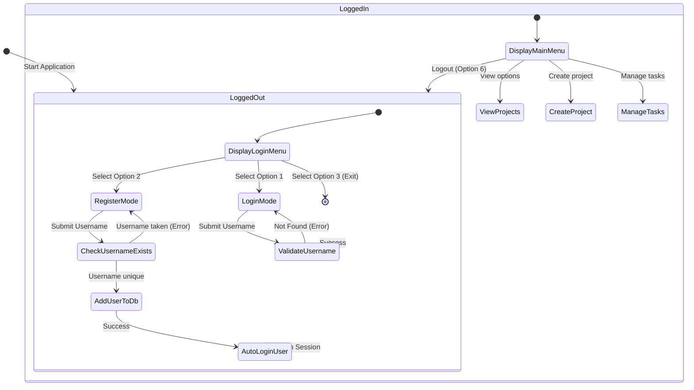
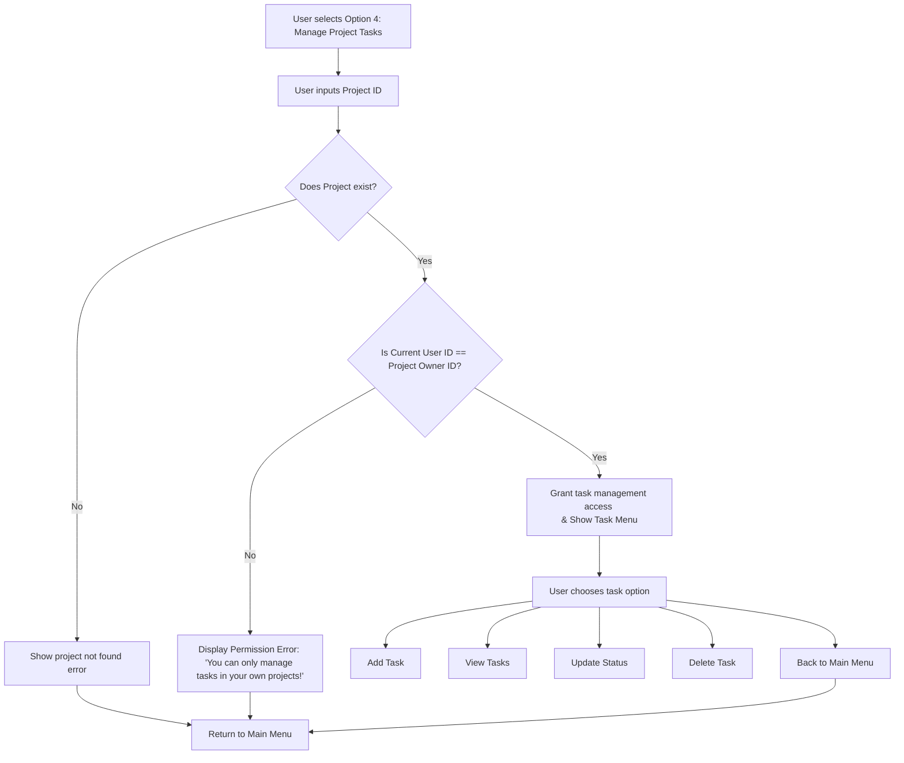
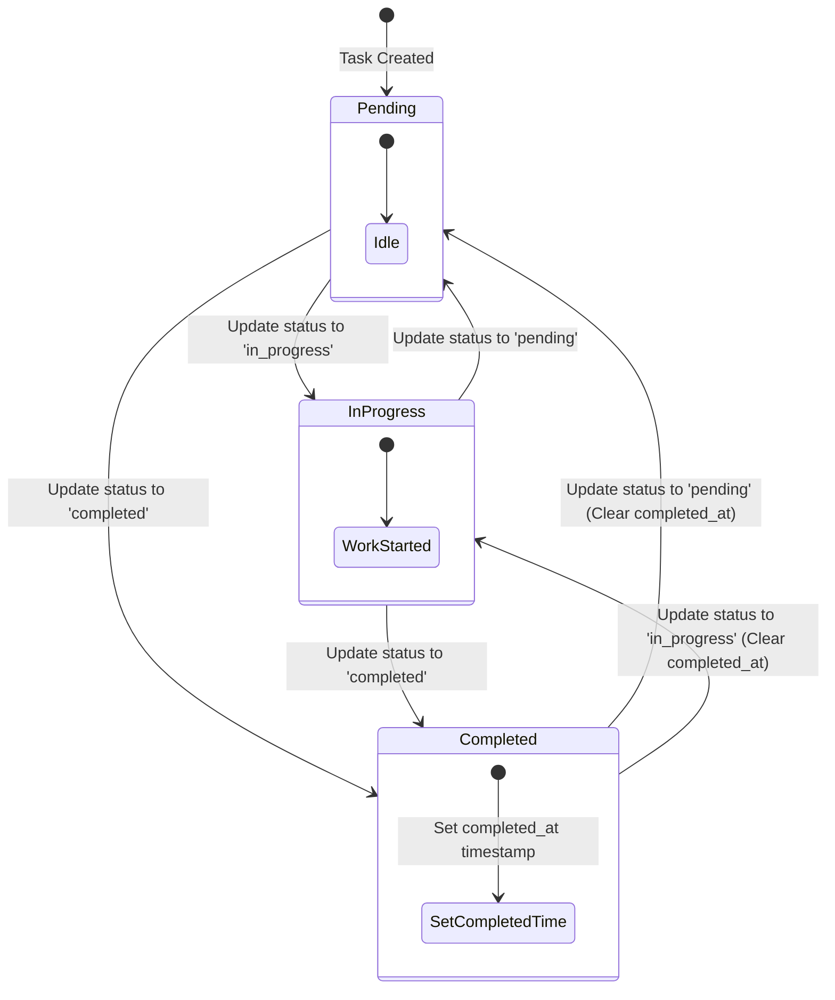

# Behavior-Driven Diagrams (BDD)

This document maps out the system behaviors using behavior diagrams (Mermaid). They define expected reactions, state changes, and permission gates across the application.

---

## 1. Authentication & Session State Diagram

Shows the behavior flow of registration, login, session validation, and logout.

---

## 2. Project Ownership & Permission Flow Diagram

Defines the system behavior and authorization gate when a user tries to manage a project's tasks.

---

## 3. Task Status Lifecycle State Diagram

Illustrates the state machine and valid state changes for individual tasks.

