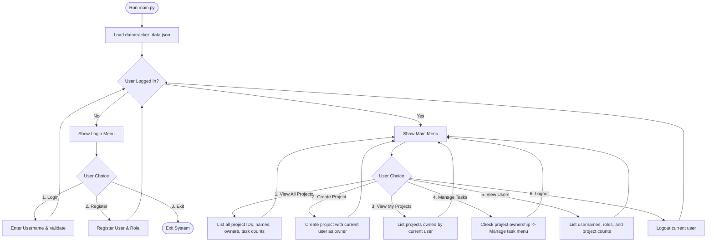

# Project Management System (Taskers1)

A terminal-based Project Management System featuring user registration/login, project creation, task management, and data persistence. Built using Python, it manages the relationship: **User → Projects → Tasks**.

---

## How It Works: System Flow

The application behaves as a structured CLI loop, interacting with JSON-based storage for persistence. Below is the step-by-step runtime flow:



### Detailed Flow Steps

1. **Initialization**:
   - Running `main.py` invokes the CLI loop in `cli.py`.
   - The system instantiates `ProjectTracker` in `models.py`, which loads existing users and projects from `models/data/tracker_data.json`.
2. **Authentication Loop**:
   - If no user is logged in, the **Login Menu** is shown.
   - The user can register a new username and select a role (admin, manager, developer, viewer), or log in with an existing username.
3. **Main Menu Loop**:
   - Once logged in, the user sees the **Main Menu**.
   - They can view all projects across the system or view only projects they own.
4. **Project and Task Management**:
   - When creating a project, the system generates an 8-character UUID. The logged-in user's ID is registered as the owner.
   - To manage tasks, the user must input the 8-character Project ID. The system checks ownership: **only the project owner can add, view, update, or delete tasks**.
5. **Persistence**:
   - Any modifications (creating projects, adding tasks, updating task statuses, deleting tasks/projects) trigger `self.tracker.save_data()`, writing updates immediately back to `tracker_data.json`.

---

## File Structure

- **[main.py](file:///wsl.localhost/Ubuntu/home/jay_joel/PYTHON/Learning/Taskers1/main.py)**: The main execution entry point for starting the CLI application.
- **[cli.py](file:///wsl.localhost/Ubuntu/home/jay_joel/PYTHON/Learning/Taskers1/cli.py)**: Handles user interaction, menus, console tables (with a fallback custom formatter in case `tabulate` is not installed), and input validation.
- **[models.py](file:///wsl.localhost/Ubuntu/home/jay_joel/PYTHON/Learning/Taskers1/models.py)**: Contains data models (`User`, `Task`, `Project`, `ProjectTracker`) and file storage I/O logic.
- **[utilis.py](file:///wsl.localhost/Ubuntu/home/jay_joel/PYTHON/Learning/Taskers1/utilis.py)**: General helper functions (date formatting, logging setup, email validator).
- **[test_tracker.py](file:///wsl.localhost/Ubuntu/home/jay_joel/PYTHON/Learning/Taskers1/test_tracker.py)**: Unit test suite for models and tracking logic.
- **[Pipfile](file:///wsl.localhost/Ubuntu/home/jay_joel/PYTHON/Learning/Taskers1/Pipfile)**: Manages dependencies (e.g., `tabulate`).

---

## Commands Reference

This section lists all the commands needed to install, run, test, and query the Project Management System.

### Prerequisites
- **Python**: version `3.12+`
- **Pipenv** (optional, recommended for virtual environments)

### 1. Installation & Environment Setup

#### Option A: Using Pipenv (Recommended)
```bash
# Install pipenv (if not already installed)
pip install pipenv

# Install project dependencies
pipenv install

# Activate the virtual environment shell
pipenv shell
```

#### Option B: Using Standard pip
If you prefer not to use `pipenv`, you can install dependencies using the standard `requirements.txt`:
```bash
pip install -r requirements.txt
```

---

### 2. Running the Application

After setting up your environment, run the main script to start the CLI loop:

#### If virtual environment is activated:
```bash
python3 main.py
```

#### Running via Pipenv (without entering shell):
```bash
pipenv run python main.py
```

---

### 3. Running Unit Tests

To run the unit test suite:

#### If virtual environment is activated:
```bash
python3 test_tracker.py
```

#### Running via Pipenv (without entering shell):
```bash
pipenv run python test_tracker.py
```

#### Running with pytest (if installed):
```bash
pytest
```

---

### 4. Database Query Utilities (JSON Queries)

These Python one-liners allow you to directly inspect or query the JSON database file (`data/tracker_data.json`) from your shell:

#### Print all usernames
```bash
python3 -c "import json; data=json.load(open('data/tracker_data.json')); print('\n'.join([u['username'] for u in data['users']]))"
```

#### Print specific user details by username (e.g., 'alice')
```bash
python3 -c "import json; data=json.load(open('data/tracker_data.json')); user=[u for u in data['users'] if u['username']=='alice']; print(user)"
```

#### Print all project names with their IDs
```bash
python3 -c "import json; data=json.load(open('data/tracker_data.json')); [print(f\"{p['project_id']}: {p['name']}\") for p in data['projects']]"
```

#### Print user ID for a specific username (e.g., 'bob')
```bash
python3 -c "import json; data=json.load(open('data/tracker_data.json')); user=[u for u in data['users'] if u['username']=='bob']; print(f\"Bob's ID: {user[0]['user_id']}\" if user else 'User not found')"
```

#### Print all tasks for a specific project ID (e.g., 'a3f5k2m9')
```bash
python3 -c "import json; data=json.load(open('data/tracker_data.json')); project=[p for p in data['projects'] if p['project_id']=='a3f5k2m9']; [print(f\"{t['task_id']}: {t['title']} - {t['status']}\") for t in project[0]['tasks']] if project else print('Project not found')"
```

#### Print summary database statistics
```bash
python3 -c "import json; d=json.load(open('data/tracker_data.json')); print(f\"Users: {len(d['users'])}\"); print(f\"Projects: {len(d['projects'])}\"); tasks=sum(len(p.get('tasks',[])) for p in d['projects']); print(f\"Total Tasks: {tasks}\")"
```
